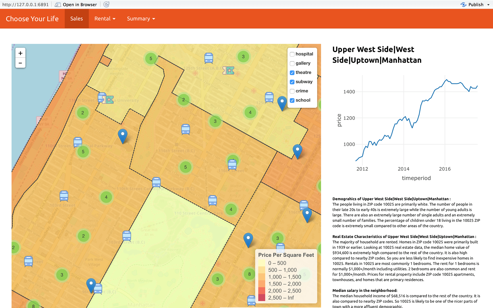

# Project 2: Open Data App using RShiny - Where do you want to live in New York City ?
Term: Fall 2017

In this second project of GU4243/GR5243 Applied Data Science, we develop an *Exploratory Data Analysis and Visualization* shiny app on a topic of your choice using U.S. government open data released on the [data.gov](https://data.gov/) website. See [Project 2 Description](doc/project2_desc.md) for more details.  

+ **Team 1 - team members:**
	+ Jing Zhao 
	+ Siyi Tao 
	+ Shuyao Hao
	+ Vassily Carantino
	+ Yufei Zhao

## introduction:

In this second project, we have developed an Rshiny application designed to help New Yorkers to find a place to live. 
This app allow the users to explore data and find the neighborhood that suits them best. 


## What is the Business Problem Solved:
It's always difficult to know where you should live when you arrive in a new city for the first time. Some neighborhood are great but too expensive, others would be cheaper but badly deserved by the subway or maybe would not be safe. 

People spend a lot of time visiting appartments before finding the neighborhood that suits them best. Similarly, Real Estate agents can spend a lot of their precious time explaining the advantages of each neighborhoods to their clients. This app has been deisgned to speed up this process and allow people to very quickly restrict their search to neighborhoods that would suit them, by answering their more important questions:

+ **on the price componant:**
	+ What is the range of prices in the neighborhood ?
	+ What is the trend of the price ? Is it a good investment to make ?
	+ What is the rent of a 1-Bedroom appartment vs 2-bedroom in the neighborhood ?
	
+ **on the neighborhood characteristics:**
	+ **Neighborhood characteristics:  What should you know about your future neighborhood ?**
	The app display all the information you should know about the neighborhood:
	 	+ the demographics of the neighborhood: age of the population, families, race
		+ information about the real estate and its evolution in the recent years
		+ the median earning of the neighborhood
	+ **Transportation: Is it well deserved ?** 	
	The app allows to display the metro station. You can easily explore the city and find the neighborhood that are the more deserved by the transportation system.
	+ **Safety: Is it a safe neighborhood ?** 
	The app allows to plot clusters of the crimes that have happen in your neighborhood during the recent years. This will be a good estimation of the safety of your neighborhood.
	+ **Education: What are the closest schools for my kids ?**
	The app can display the schools that are the closest to your place. That will allow you to very quickly check if this neighborhood is good for your children.
	+ **Health: How close am I from the next hospital ?** 
	The app also displays all the health facilities around your future place. This will allow the more carefull users to choose their place accordingly.
	+ **Entertainment: Is there theatres close-by ? Can I easily go visit an art gallery ?** 
	Finally, the app can help you understand if you will be able to have an artistic life in your neighborhood by displaying the closest theatres and art galleries.
	
## Data Sources:

+ Crime data comes from https://www.data.gov/
+ Rental Prices data comes from https://www.zillow.com/
+ Sales Prices data comes from https://www.zillow.com/
+ School data comes from https://opendata.cityofnewyork.us/
+ Hospitals data comes from https://opendata.cityofnewyork.us/
+ Art Galleries data comes from https://opendata.cityofnewyork.us/
+ Theatres data comes from https://opendata.cityofnewyork.us/
 
 All the information on the neighborhood (demographics, real estate information, earnings data) was queried using a web crawler on this website: https://www.unitedstateszipcodes.org/
 
 We used Google Map API to get the precise location corresponding to the different addresses.


## Contribution statement: 

Team members: Jing Zhao, Siyi Tao, Shuyao Hao, Vassily Carantino, Yufei Zhao

All team members contributed equally in all stages of this project. All team members approve our work presented in this GitHub repository including this contributions statement. 

Following [suggestions](http://nicercode.github.io/blog/2013-04-05-projects/) by [RICH FITZJOHN](http://nicercode.github.io/about/#Team) (@richfitz). This folder is orgarnized as follows.

```
proj/
├── app/
├── lib/
├── data/
├── doc/
└── output/
```

Please see each subfolder for a README file.

